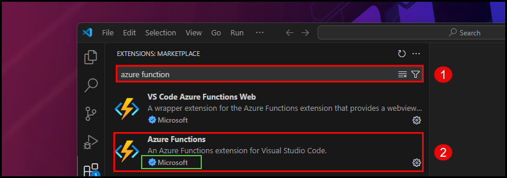
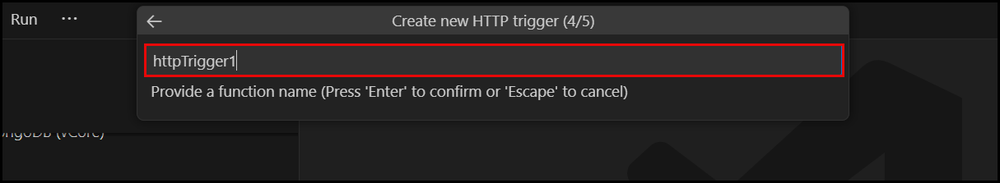
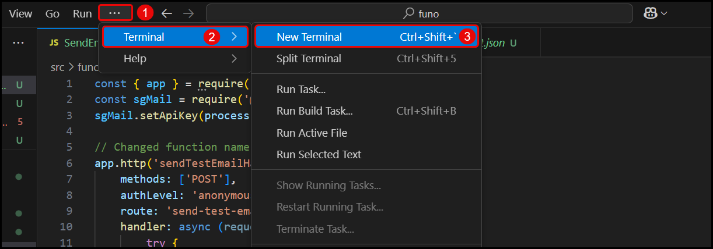

## Introduction
Azure App Function is a serverless compute service that enables you to run event-driven code without having to explicitly provision or manage infrastructure. This document provides a comprehensive guide to setting up, deploying, and managing an Azure App Function.

## Prerequisites
Before you begin, ensure you have the following prerequisites in place:
- An Azure subscription.
- Azure CLI installed on your local machine.
- Visual Studio Code with the Azure Functions extension.
- Basic understanding of Azure Functions and serverless architecture.

## Setup
### Create a Function App

   **Using VS CODE STUDIO**:
   
   
 
   # Visual Studio Code Setup

   1. Download and install Visual Studio Code from [official site](https://code.visualstudio.com/).
   2. Launch VS Code and install the Azure Functions extension.
   3. Sign in to your Azure account through the Azure extension.

   

## Launching Visual Studio Code

1. Locate the Visual Studio Code shortcut on your desktop or in your applications list.
2. Right-click the shortcut and select "Open" from the context menu.

   

## Adding Extensions in Visual Studio Code

1. Click the "Extensions" button on the welcome page to begin using Visual Studio Code.

   

## Installing Extensions in Visual Studio Code

1. Click on the Extensions icon in the Activity Bar.
2. Search for the desired extension using the search bar.

   

## Installing the Azure Functions Extension

1. Search for "azure function" in the Extensions Marketplace.
2. Select the "Azure Functions" extension by Microsoft and install it.

   

## Installing the Azure Functions Extension

1. Click "Install" to add the Azure Functions extension to Visual Studio Code.

   
   

## Post-Installation of Azure Functions Extension

1. After installation, you can manage the extension by clicking on "Disable" or "Uninstall" if needed.
2. Ensure "Auto Update" is checked to keep the extension up to date.

   
   

## Searching for and Executing Azure Functions Commands

   
### Step 1: Accessing the Search Bar
1. Use the search bar at the top of the Visual Studio Code window to find commands.

   
   

### Step 2: Searching for Files
1. Type `Search files by name` and select the corresponding command to search for files.

   
   

### Step 3: Creating an Azure Function App
1. Type `Azure Functions: Create Function App in Azure...` in the search bar.
2. Select the command from the list to start creating a new Azure Function App.

   
   

## Signing in to Azure

1. Select "Sign in to Azure..." from the command list to authenticate with your Azure account.

   
   

## Authorizing the Azure Resources Extension

1. Click "Allow" to grant the "Azure Resources" extension permission to sign in using your Microsoft account.

   

## Microsoft Account Sign-In

1. Enter your email, phone number, or Skype username into the provided field.
2. Click "Next" to proceed with the sign-in process.

   

## Viewing Azure Accounts and Tenants

1. After signing in, view your Azure accounts and tenants in the Azure extension.
2. Select the desired account and tenant to work with in Visual Studio Code.

   

## Accessing Azure Resources

1. Expand the "RESOURCES" section in the Azure panel.
2. Navigate through your subscriptions and resource groups to access and manage your Azure resources.

   

## Selecting an Azure Subscription

1. Choose the desired Azure subscription from the list to manage resources within that subscription.

   

## Naming a New Function App

1. Enter a unique name for your Function App in the provided text box.
2. Press 'Enter' to confirm the name or 'Escape' to cancel the process.

   

## Selecting a Location for Azure Resources

1. Choose a location for your new Function App from the list of available regions.
2. The 'Recommended' tag helps identify preferred regions for optimal performance.

   

## Choosing a Runtime Stack for Azure Function App

1. Select a runtime stack for your Function App from the available options.
2. Options include .NET (Isolated), Java, and Node.js, among others.
3. The recently used runtime is indicated for convenience.

   

## Selecting Instance Memory Size for Azure Function App

1. Choose the memory size for your Function App instance from the available options.
2. Options include 4096 MB (recently used), 2048 MB (default), and 512 MB.

   
   
## Setting Maximum Instance Count for Azure Function App

1. Enter the maximum number of instances for your Function App.
2. Press 'Enter' to confirm the instance count or 'Escape' to cancel.

   

## Creating App Service Plan for Azure Function App

1. Visual Studio Code initiates the creation of an App Service plan named "FLEX-<FunctionAppName>".
2. Monitor the progress in the "AZURE" tab of the output window.

   

## Accessing Function Apps in Azure Resources

1. In the Visual Studio Code Azure extension, navigate to the "RESOURCES" section.
2. Expand the subscription and resource group where your Function App is located.
3. Click on "Function App" to access and manage your Function Apps.

   

## Accessing Azure Blob Storage via URL

1. Use the following URL format to access a blob in Azure Storage:

   

## Recent Download History

1. **File:** `funo.zip`
   - **Size:** 1,630 KB
   - **Time:** 2 minutes ago

2. **File:** `PostAnalytics_GirishR_7323029313937641472.xlsx`
   - **Size:** 5.4 KB
   - **Time:** 11 hours ago

   

## List of Function Apps in Visual Studio Code

1. **Function Apps:**
   - `AizenSama` (Stopped)
   - `blobfunction258` (Stopped)
   - `blobtriggeredfunctionapp147` (Flex Consumption)
   - `functionapptejeesh`
   - `funtappo` (Flex Consumption)
   - `giriapp` (Flex Consumption)
   - `imgtriggerfunc123`
   - `newfuntrigger` (Stopped)
   - `priti1223` (Stopped)
   - `sahan5`
   - `test5443` (Stopped)

2. **Other Azure Resources:**
   - Container Apps
   - Durable Task Scheduler
   - Logic App
   - Managed Identities

   

## Managing Azure Function App in Visual Studio Code

1. **Selecting a Function App:**
   - In the Azure extension, navigate to the "Function App" section.
   - Click on `functionapptejeesh` to select it for management.

2. **Creating a New Function Project:**
   - In the Command Palette, type and select `Create Function Project...`.
   - This action initiates the process of creating a new Function App project within your local workspace.

   

## Selecting a Local Folder for Function App Project

1. Navigate to the desired local folder where you want to create the Function App project.
   - Example path: `C:\1\spektra\doc\images\word\webo`

2. Highlight the folder named `funo` and click the "Select" button to choose it as the workspace for your new Function App project.

   

## Selecting a Function Template

1. Choose a template for your project's first function from the list of available options.
2. The recently used template is indicated for convenience.
3. Available templates include:
   - HTTP trigger
   - Timer trigger
   - Azure Blob Storage trigger
   - Azure Cosmos DB trigger
   - Durable Functions entity
   - Durable Functions orchestrator
   - Azure Blob Storage trigger (using Event Grid)
   - Azure Event Grid trigger
   - Azure Event Hub trigger
   - Azure Queue Storage trigger
   - Azure Service Bus Queue trigger
   - Azure Service Bus Topic trigger
4. Select "HTTP trigger" to create a function that responds to HTTP requests.

   

## Naming a New HTTP Trigger Function

1. Enter a name for your HTTP trigger function in the provided text box.
2. Press 'Enter' to confirm the function name or 'Escape' to cancel the process.   

   

## Opening a New Terminal in Visual Studio Code

1. Click on the "Terminal" menu in the top menu bar.
2. Select "New Terminal" from the dropdown menu.
   - Alternatively, use the keyboard shortcut `Ctrl+Shift+``

   

## Starting an Azure Function App from Terminal

1. Open a new terminal in Visual Studio Code.
2. Navigate to the directory containing your Function App project.
3. Run the command `func start` to start the Function App.

   

## Allowing Network Access for Azure Functions Core Tools

1. When prompted by Windows Security, select "Allow" to grant public and private networks access to the Azure Functions Core Tools.
2. This permission is necessary for the `func start` command to work properly and allow your Function App to be accessed over the network.

   

## Starting the Azure Function App

1. Open the terminal in Visual Studio Code.
2. Navigate to the directory containing your Function App project.
3. Run the command `func start` to start the Function App.
4. The terminal will display the starting process and initialization details.
5. Once started, the Function App's endpoint will be displayed in the terminal.
   - Example endpoint: `http://localhost:<port>/<function_name>`
6. You can access the Function App by navigating to the provided endpoint in a web browser.

   
   

## Adding a New Item to Your Workspace

1. Navigate to your workspace page.
2. Click on the "+" button in the "Overview" section.
3. Select from the available options to add a new item to your workspace.
   - Options may include API demos, More templates, etc.

   

### Configuring a POST Request

1. **Select HTTP Method:**
   - Choose the `POST` method from the dropdown menu to set up a POST request.

2. **Enter Request URL:**
   - Input the URL for your request in the address bar.
   - Example: `http://localhost:7071/api/send-test-email`

3. **Configure Request Body:**
   - Navigate to the `Body` tab to define the data you want to send with your POST request.
   - Add key-value pairs or JSON objects as needed for your specific use case.

   

## Sending a POST Request with JSON Body

1. **Select the 'raw' option:**
   - Choose 'raw' in the 'Body' section to specify the type of data you're sending.

2. **Choose the 'JSON' type:**
   - Select 'JSON' from the dropdown menu to indicate that the request body will contain JSON data.

3. **Send the Request:**
   - Click the 'Send' button to execute the POST request with the specified JSON body.   

   

## Viewing the Response to a POST Request

1. **Response Body:**
   - The response body contains a JSON object.
   - Example response: `{ "success": true }`

2. **HTTP Status Code:**
   - The HTTP status code `200 OK` indicates a successful request.

   

## Email Confirmation of Azure Function App Test

1. **Email Subject:**
   - "Test Email from Azure - This email confirms your function is working!"

2. **Sender:**
   - `ted.girish17@outlook.com`

3. **Content:**
   - The email serves as a confirmation that the Azure Function App has been successfully tested and is operational.

   

### Email Confirmation of Azure Function App Test

1. **Email Subject:**
   - "Test Email from Azure"

2. **Sender:**
   - `ted.girish17@gmail.com` via `sendgrid.net`

3. **Content:**
   - "This email confirms your function is working!"
