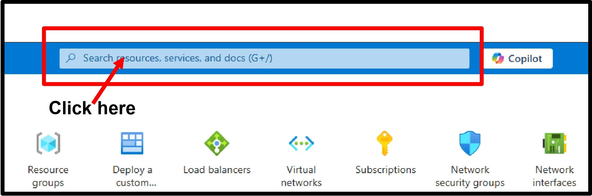
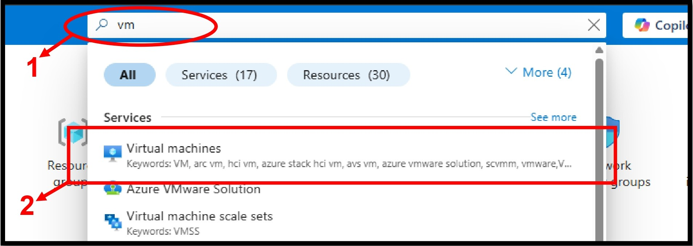
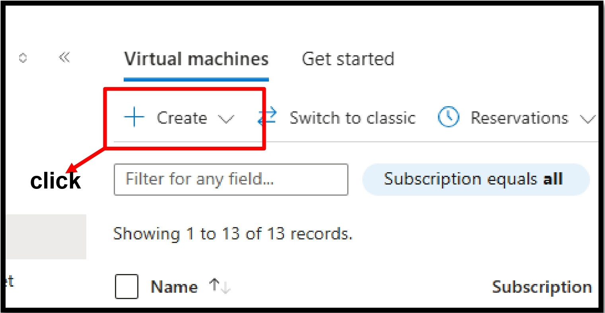
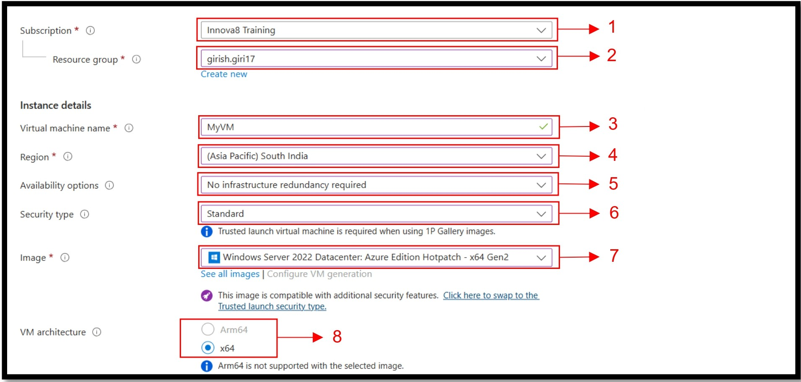
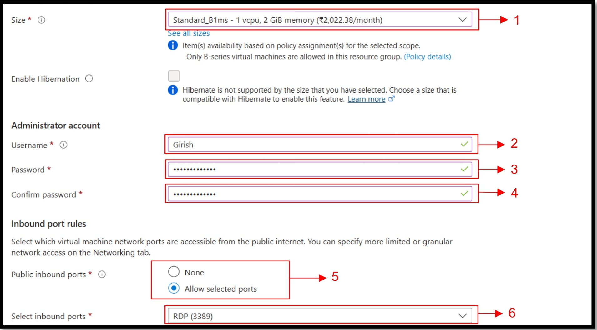
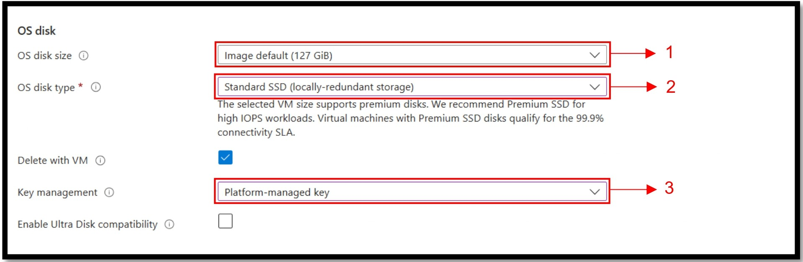
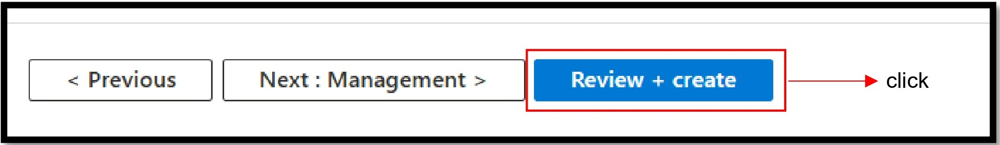
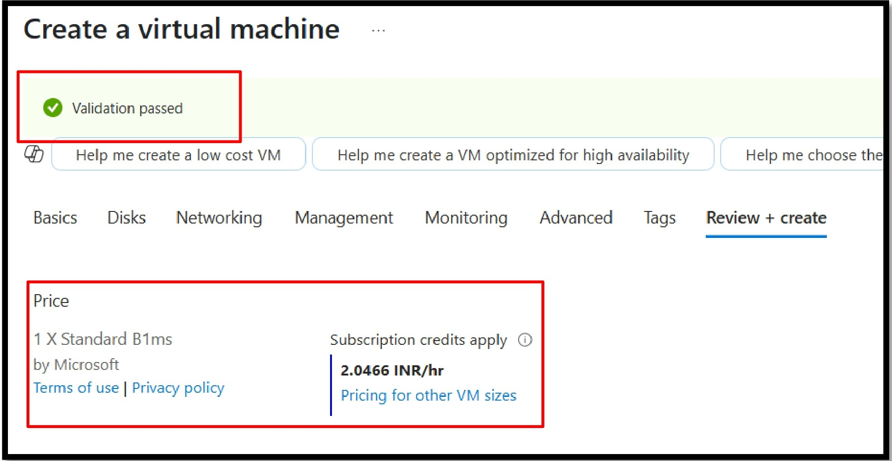

# 🖥️ Creating a Virtual Machine in Azure: Complete Guide

Welcome to this complete guide on how to create a Virtual Machine (VM) in Microsoft Azure using various methods.

---

## 📚 Table of Contents

- [📌 Introduction](#-introduction)
- [🛠️ Prerequisites](#-prerequisites)
- [1️⃣ Using Azure Portal (GUI)](#-1-using-azure-portal-gui)
- [2️⃣ Using Azure CLI](#-2-using-azure-cli)
- [3️⃣ Using PowerShell](#-3-using-powershell)
- [4️⃣ Using ARM Templates](#-4-using-arm-templates)
- [5️⃣ Using Bicep](#-5-using-bicep)
- [📄 Conclusion](#-conclusion)
- [📎 References](#-references)

---

## 📌 Introduction

Creating a Virtual Machine (VM) in Azure can be done using multiple methods depending on the user’s preference, use case, and level of automation required. This guide will walk you through **all the major methods** with step-by-step instructions and screenshots/code examples.

## 🛠️ Prerequisites

- An active **Azure Subscription**
- Basic knowledge of Azure services
- Access to [Azure Portal](https://portal.azure.com/)
- Azure CLI or PowerShell installed for CLI methods
- VS Code (optional) for template-based deployment
---

## 1️⃣ Using Azure Portal (GUI)

---

## 1️⃣ Using Azure Portal (GUI)

Creating a VM via Azure Portal is the most user-friendly method, especially for beginners. It provides a guided interface to configure and launch a VM easily.

---

### 🪜 Steps to Create a VM via Azure Portal:

#### 🔹 Step 1: Login & Open VM Section

1. Go to the [Azure Portal](https://portal.azure.com/)
2. In the top search bar, type **"Virtual Machines"** and select it  
     
   

3. Click **+ Create** → **Azure Virtual Machine**  
   

---

### 🧾 Step 2: Fill in the Basics Tab

This section captures the core configuration of your VM:

#### 🧩 Basic Settings:
- **Subscription:** Choose your active subscription  
- **Resource Group:** Create new or select existing  
- **VM Name:** Example – `MyVM`  
- **Region:** Choose a nearby region (e.g., South India)  
- **Availability Options:** Leave default unless needed  
- **Security Type:** Keep as "Standard"  
- **Image:** Choose your OS (e.g., Windows Server 2022)  
- **Architecture:** Select `x64`  

---

### 🧑‍💻 Step 3: VM Size & Admin Credentials

- **Size:** Click “Change size” → Select `Standard_B1ms` (1 vCPU, 2 GiB RAM)  
- **Username:** Enter your admin name (e.g., `Girish`)  
- **Password:** Enter and confirm a strong password  
- **Public Ports:** Select `Allow selected ports` → Choose **RDP (3389)**  

---

### 💽 Step 4: Configure the OS Disk

- **OS Disk Size:** Leave default or choose custom  
- **OS Disk Type:** Choose `Standard SSD` (LRS)  
- **Delete with VM:** Keep it checked  
- **Key Management:** Leave as `Platform-managed`  

---

### 🌐 Step 5: Configure the Network Interface

- **Virtual Network:** Select existing or create new  
- **Public IP:** Auto-assign or create new  
- **NIC Network Security Group (NSG):**
  - `None`: No access
  - `Basic`: Default recommended
  - `Advanced`: Custom rules  
- **Inbound Ports:** Choose:
  - `None` (no internet access)
  - ✅ `Allow selected ports` → Select **RDP (3389)** or **SSH (22)**  

---

### 🧾 Step 6: Review + Create

- Click on **Review + Create**  

- Azure validates all settings – if successful, you’ll see:  
  ✅ **Validation Passed**  
  💸 Estimated pricing (e.g., `2.0466 INR/hr`)  

---

### 🚀 Step 7: Launch the Deployment

- Click **Create** to start the VM deployment  

- Deployment may take 1–2 minutes

---

## 🧠 Tips & Best Practices

✅ Use **Tags** to organize your resources  
✅ Enable **Availability Zones** for high availability  
✅ Turn on **Boot Diagnostics** under Monitoring tab for better debugging

---

### 🎉 Deployment Complete!

You can now:
- View the VM in the **“Virtual Machines”** blade
- Use **RDP** (Windows) or **SSH** (Linux) to connect
- Start/stop/manage it anytime via Azure Portal

---
