# Azure Logic App Creation Documentation

## Introduction

Azure Logic Apps is a cloud-based integration service that helps you automate and orchestrate tasks, business processes, and workflows across various applications and services. Logic Apps provides a visual designer and a rich set of connectors to integrate with different systems, making it easier to build scalable and reliable workflows.

This document provides a step-by-step guide on how to create a Logic App in Azure, covering the essential steps and considerations to help you get started quickly.

## Prerequisites

Before you begin, ensure you have the following:

- An active Azure subscription. If you don't have one, you can [create a free account](https://azure.microsoft.com/free/).
- Basic understanding of Azure services and concepts.
- Access to the Azure portal.

## Steps to Create a Logic App

### Step 1: Sign in to the Azure Portal

1. Open your web browser and navigate to the [Azure portal](https://portal.azure.com/).
2. Sign in using your Azure account credentials.

### Step 2: Access Logic Apps Service

   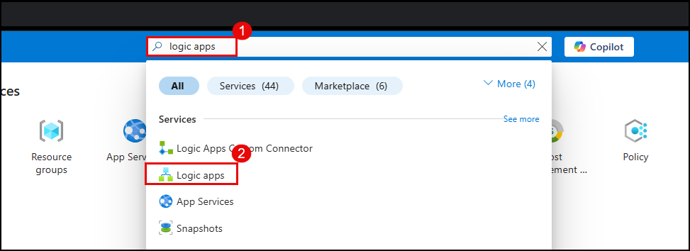

1. In the Azure portal, click on the **+ Create a resource** button.
2. Search for **Logic Apps** in the search bar as indicated by the number **1** in the image.
3. Click on **Logic apps** from the list of services as highlighted by the number **2**.

### Step 3: Create a New Logic App

   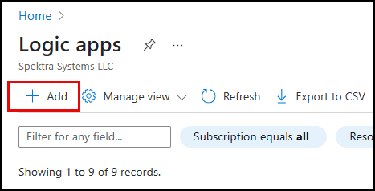

1. After accessing the Logic Apps service, you will be presented with the Logic Apps dashboard.
2. To create a new Logic App, click on the **+ Add** button as shown in the image.
3. This action will open the **Create Logic App** blade where you can configure your new Logic App.

### Step 4: Choose a Hosting Option

   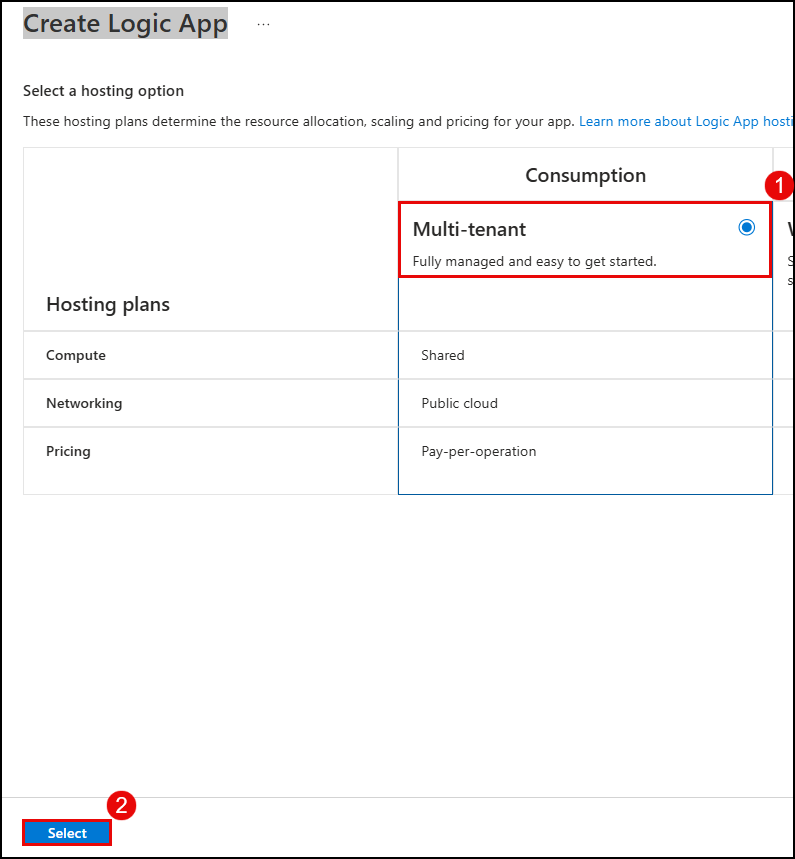

1. In the **Create Logic App** blade, you will need to select a hosting option. The hosting plan determines the resource allocation, scaling, and pricing for your app.
2. Choose the **Multi-tenant** option under the Consumption plan. This option is fully managed and easy to get started with, as indicated by the description in the image.
3. After selecting the **Multi-tenant** option, click on the **Select** button to proceed.

### Step 5: Configure Logic App Settings

   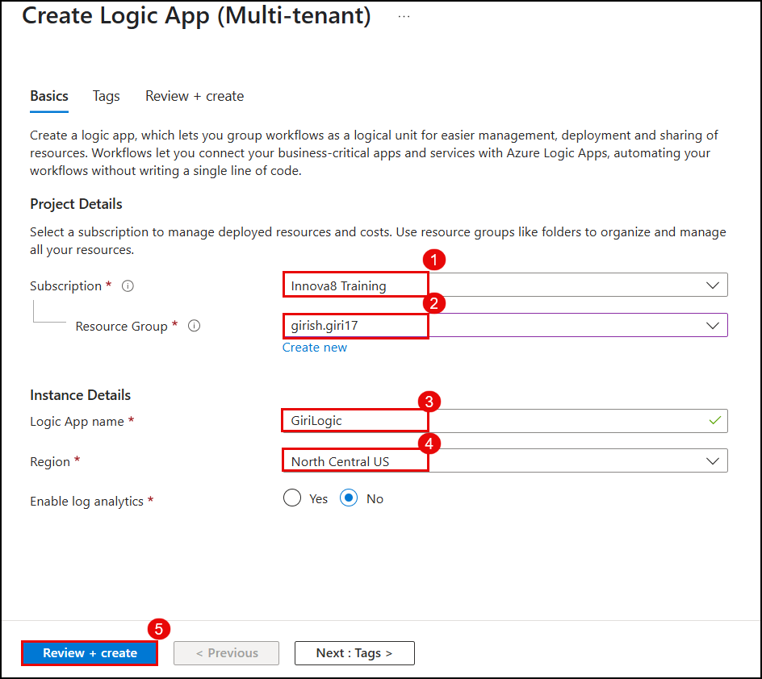

1. **Subscription**: Choose the Azure subscription where you want to create the Logic App. For example, select **Innova8 Training** as shown in the image.
2. **Resource Group**: Select or create a resource group. In the image, the resource group **girish.giri17** is selected.
3. **Logic App name**: Enter a unique name for your Logic App. The example name used in the image is **GiriLogic**.
4. **Region**: Choose the region for deploying your Logic App. The selected region in the image is **North Central US**.
5. **Enable log analytics**: Optionally, enable log analytics if you want to collect logs for monitoring and analysis.
6. After filling in all the required details, click on the **Review + create** button to proceed to the next step.

### Step 6: Create the Logic App

   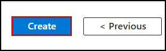

1. After reviewing your settings on the previous page, you will be presented with the final confirmation page.
2. Click the **Create** button to start the deployment of your new Logic App.
3. Azure will now provision the resources needed for your Logic App. This process may take a few minutes.
4. Once the deployment is complete, you can access your Logic App from the Azure portal to start designing your workflow.

### Step 7: Deployment Confirmation

   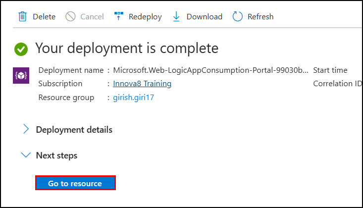

1. Once the deployment process is complete, you will see a confirmation message stating that your deployment is complete.
2. The deployment details will include the deployment name, subscription, and resource group used for the Logic App.
3. To access your newly created Logic App, click the **Go to resource** button. This will take you to the Logic App's main page where you can begin designing your workflow.

### Step 8: Add a Trigger to Your Logic App

   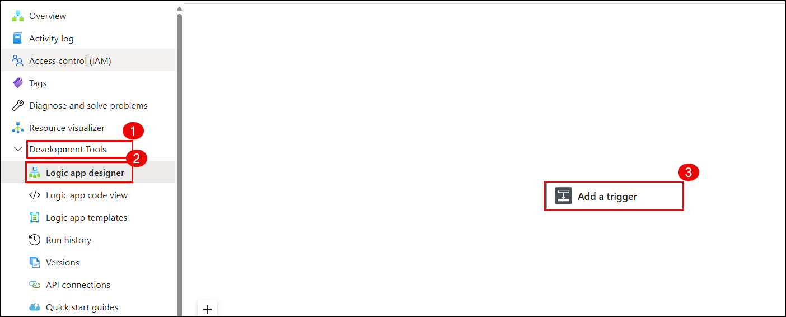

1. After you've navigated to your Logic App's main page, locate the **Development Tools** section in the left-hand menu.
2. Click on **Logic app designer** to open the visual designer for your Logic App.
3. In the Logic app designer, click on the **Add a trigger** button to start defining the workflow for your Logic App.
4. A list of available triggers will appear. Choose the trigger that best fits the event you want your workflow to start with.

### Step 9: Select an HTTP Trigger

   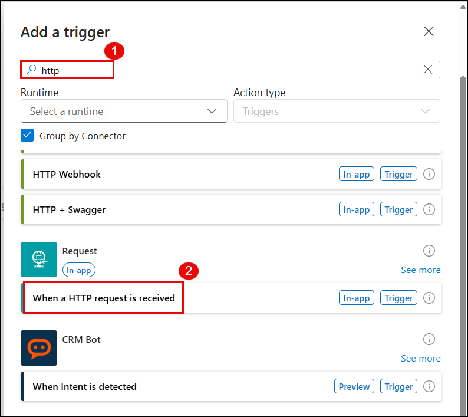

1. In the Logic App Designer, click on **Add a trigger** to open the trigger selection pane.
2. In the search bar, type **http** to filter the available triggers.
3. From the list of triggers, select **When a HTTP request is received**. This trigger will start your Logic App workflow when an HTTP request is made to the specified endpoint.
4. After selecting the trigger, configure the trigger settings such as the request method and the expected request body format.
5. Save your Logic App to deploy the endpoint and make it accessible for incoming HTTP requests.

### Step 10: Configure the HTTP Trigger

   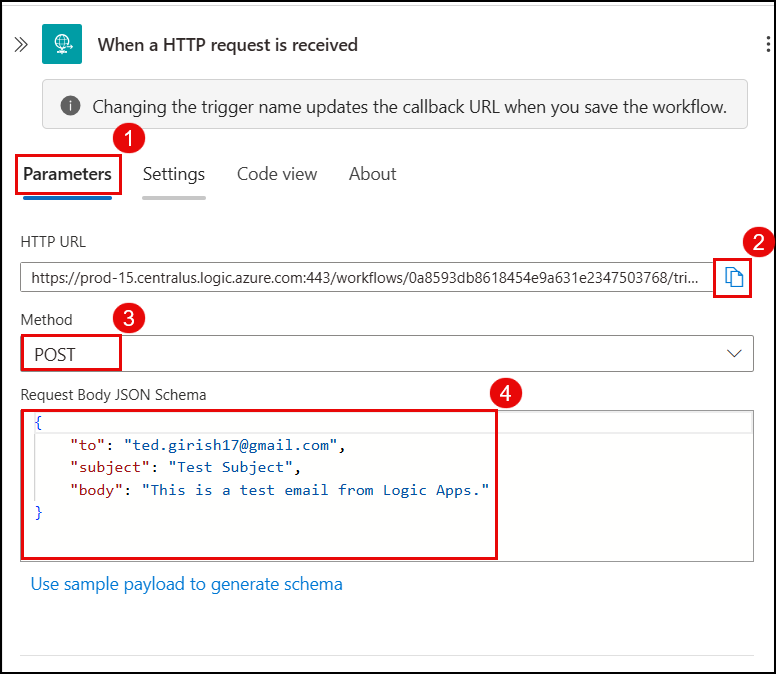

1. **Parameters Tab**: After selecting the trigger, you will see various configuration options. Start on the **Parameters** tab to configure the trigger settings.
2. **HTTP URL**: Note the automatically generated HTTP URL provided by Azure. This URL will be used to trigger your Logic App workflow. You can copy this URL by clicking the copy icon next to it.
3. **Method**: Choose the HTTP method for the trigger. In this example, select **POST** as the method.
4. **Request Body JSON Schema**: Define the expected JSON schema for the request body. This schema helps Azure validate the incoming request data. In the example, the schema expects an object with properties for "to", "subject", and "body".
```json
{
  "to": "ted.girish17@gmail.com",
  "subject": "Logic App Test Email",
  "body": "This is a test email sent from Logic App using Postman."
}
```
5. **Save**: After configuring the trigger, save your Logic App to ensure the changes are deployed.

### Step 11: Add an Action to Your Logic App

   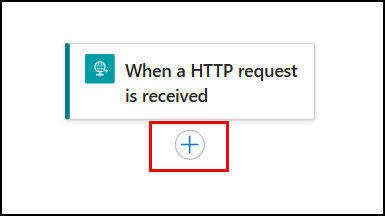

1. After configuring the trigger, you will see the trigger step in the Logic App Designer.
2. To add an action to your workflow, click on the **+** icon below the trigger step.
3. A new pane will open where you can search for and select an action. Choose an action that will be executed after the trigger is activated.

### Step 12: Add an Email Action

   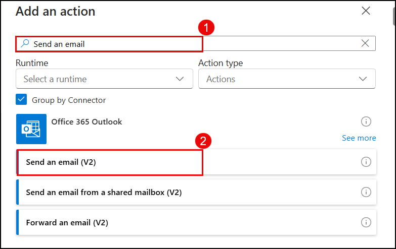

1. In the Logic App Designer, after setting up the trigger, you will need to add an action to define what happens next.
2. Click on the **+** icon to add a new action.
3. In the search bar, type **Send an email** to find the relevant action.
4. From the list of actions, select **Office 365 Outlook** and then choose **Send an email (V2)**.
5. After selecting the action, you will be prompted to authenticate and authorize the Office 365 Outlook connector to access your email account.
6. Once authenticated, you can configure the email action by setting properties such as the recipient's email address, subject, and body of the email.
7. Save your Logic App to deploy the action and complete your workflow setup.

### Step 13: Create an Office 365 Outlook Connection

   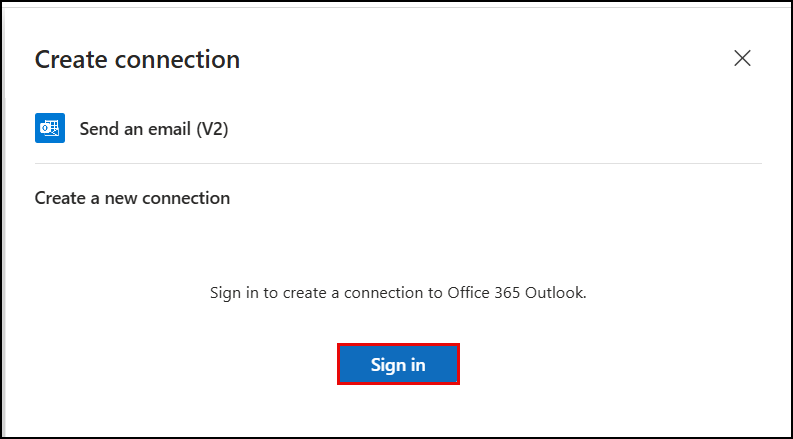

1. After selecting the **Send an email (V2)** action, you will be prompted to create a new connection to Office 365 Outlook.
2. Click on the **Sign in** button to authenticate and authorize the connection.
3. You will be redirected to the Office 365 Outlook login page. Enter your Office 365 credentials and complete the sign-in process.
4. Once signed in, grant the necessary permissions for the Logic App to send emails on your behalf.
5. After successful authentication, you can configure the email action with details such as the recipient's email address, subject, and body.
6. Save your Logic App to deploy the connection and complete your workflow setup.

### Step 14: Configure the Email Action

   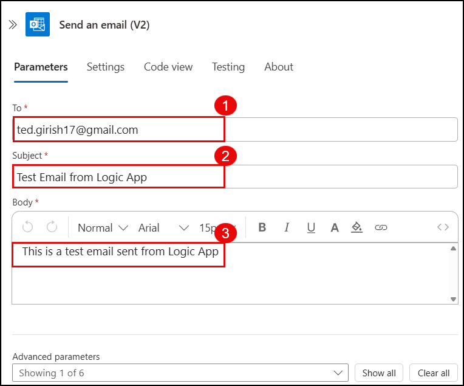

1. **To**: Enter the recipient's email address where the email will be sent. For example, `ted.girish17@gmail.com`.
2. **Subject**: Set the subject line of the email. In this example, use `Test Email from Logic App`.
3. **Body**: Compose the body of the email. You can format the text using options like bold, italic, underline, etc. The example body is `This is a test email sent from Logic App`.
4. After configuring the email action, save your Logic App to deploy the changes.

### Step 15: Test the Logic App with a GET Request

   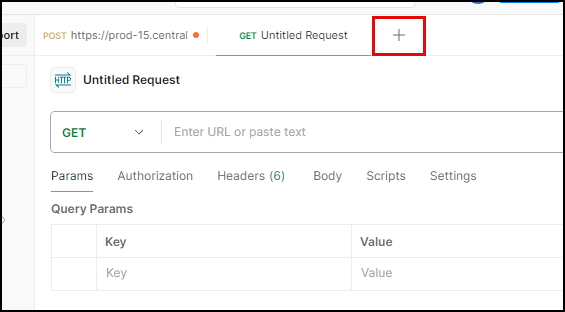

1. Open your HTTP client tool (e.g., Postman).
2. Click on the **+** button to create a new request.
3. Set the request type to **GET**.
4. Enter the URL of the Logic App's HTTP trigger that you noted earlier.
5. Configure any necessary query parameters in the **Params** tab.
6. Send the request to trigger your Logic App and observe the response.

### Step 16: Send a POST Request to Trigger the Logic App

   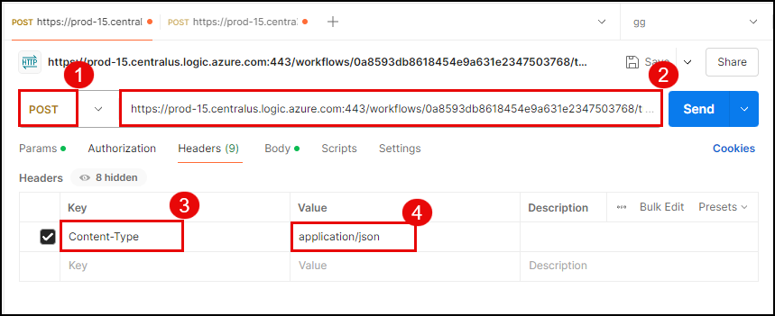

1. **Method**: Set the HTTP method to **POST** as indicated by the number **1** in the image.
2. **URL**: Enter the callback URL of your Logic App's HTTP trigger as shown by the number **2**. This URL is specific to your Logic App and can be found in the Azure portal.
3. **Headers**: Add a **Content-Type** header with the value **application/json** as highlighted by the numbers **3** and **4**. This header tells the server that the request body will contain JSON data.
4. **Body**: Compose the request body in JSON format according to the schema you defined in your Logic App's trigger. This body will contain the data that your Logic App will process.
5. **Send**: Click the **Send** button to send the POST request to your Logic App. This will trigger the workflow defined in your Logic App.
6. After sending the request, observe the response from your Logic App to ensure it processed the request as expected.

### Step 17: Send a POST Request with JSON Body

   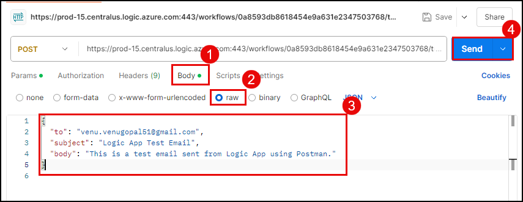

1. **Method**: Ensure the HTTP method is set to **POST**.
2. **URL**: Enter the callback URL of your Logic App's HTTP trigger.
3. Navigate to the **Body** tab as indicated by the number **1**.
4. Select the **raw** radio button as shown by the number **2** to enter the request body in raw format.
5. Choose the **JSON** option from the dropdown menu next to the **raw** radio button as indicated by the number **3** to specify the content type of the request body.
6. Enter the JSON data that matches the schema defined in your Logic App's trigger. For example:

```json
{
  "to": "venu.venugopal51@gmail.com",
  "subject": "Logic App Test Email",
  "body": "This is a test email sent from Logic App using Postman."
}
```

### Step 18: Verify the Email Delivery
   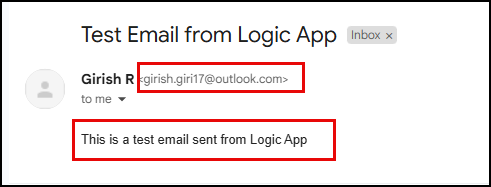


1. After sending the POST request to your Logic App's HTTP trigger, check your email inbox where you configured the email to be sent.

2. Look for an email from the Logic App with the subject and body content that you specified in your Logic App's email action configuration.

3. Open the email and verify that the content matches what you defined in the Logic App's email action.

4. If the email is received as expected, it confirms that your Logic App's HTTP trigger and email action are functioning correctly.

